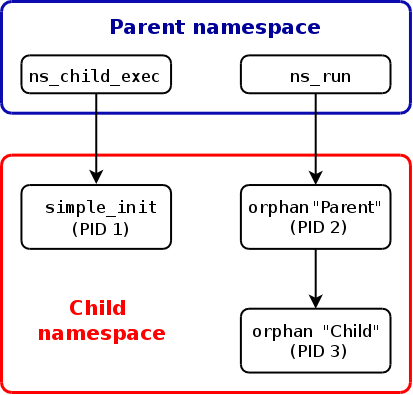
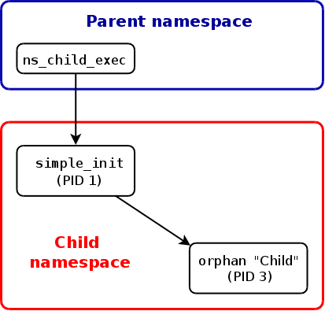

# この文書について

この文書は [lwn.net](https://lwn.net/) において 2013 年に公開された Namespaces in Operation シリーズのパート 4  ([http://lwn.net/Articles/532748/](http://lwn.net/Articles/532748/)を翻訳したものです。

この文書のライセンスは原文と同じく、[Creative Commons CC BY-SA 4.0](https://creativecommons.org/licenses/by-sa/4.0/) のもとに提供されています。

# Namespaces in operation, part 4: more on PID namespaces

この記事では、PID 名前空間に関する[先週の議論](http://lwn.net/Articles/532271/)を続ける (そして名前空間に関する進行中の[シリーズ](http://lwn.net/Articles/531114/#series_index)を続ける)。PID 名前空間の利用法の一つは、パッケージ化したプロセス (コンテナ) を実装することである。これは独立した Linux システムのように振る舞う。伝統的なシステムのキーとなる部分は `init` プロセスである。そしてこれは PID 名前空間を使ったコンテナでも同様である。なので、`init` プロセスの特別な役割を調べ、伝統的な `init` プロセスとは違う点について 1 つ、2 つ述べる。加えて、PID 名前空間に適用する時の名前空間 API の他の詳細を調べる。

## PID 名前空間の init プロセス

PID 名前空間内で最初に作られるプロセスは、名前空間内でプロセス ID 1 を取得する。このプロセスは伝統的な Linux システムの `init` プロセスと同様の役割を持つ。特に、`init` プロセスは PID 名前空間全体 (例えば多分、開始する名前空間の標準部分であるであろう他のプロセス) に必要な初期化を行う能力があり、他とは独立した名前空間内のプロセスの親になる。

PID 名前空間の操作を説明するために、特定の目的で作られたいくつかのサンプルプログラムを利用する。このプログラムの最初は [ns_child_exec.c](http://lwn.net/Articles/533492/) で、以下のようなコマンドライン文法である。

```
ns_child_exec [options] command [arguments]
```

`ns_child_exec` プログラムは、子プロセスを作成するのに `clone()` システムコールを使用する。そして、子供は与えられた `command` を指定した `arguments` を引数に実行する。`options` の主目的は `clone()` の呼び出しで作成される新しい名前空間を指定するためのものである。例えば、`-p` オプションでは、以下のように子供が新しい PID 名前空間内に作られる。

```
$ su                  # Need privilege to create a PID namespace
Password:
# ./ns_child_exec -p sh -c 'echo $$'
1
```

コマンドで子プロセスが新しい PID 名前空間内に作られ、シェルの `echo` コマンドが実行され、シェルの PID が表示されている。1 という PID を持ち、シェルは実行中である間(少しの間だけ)存在した PID 名前空間に対する `init` であった。

次のプログラムは [simple_init.c](http://lwn.net/Articles/533493/) であり、これは PID 名前空間の `init` プロセスとして実行されるプログラムである。

`simple_init` プログラムは `init` の主要な 2 つの機能を実行する。1 つ目は『システムの初期化』である。ほとんどの `init` システムはもっと複雑なプログラムであり、システムの初期化に対してテーブル駆動のアプローチを取る。ここでの (もっとシンプルな) `simple_init` プログラムは、シンプルなシェルであり、ユーザが手動で名前空間の初期化に必要などのようなコマンドでも実行が可能なものである。このアプローチは名前空間内での実験を実行するためのシェルコマンドを自由に実行することも可能となる。`simple_init` が実行する 2 つ目の機能は、`waitpid()` を使って子供が終了するステータスを取得することである。

それゆえ、例えば、PID 名前空間内で実行する `init` プロセスを起動するために、ns_child_exec プログラムを `simple_init` と連携させて使うことが可能である。

```
# ./ns_child_exec -p ./simple_init
init$
```

`init$` プロンプトは `sinple_init` プログラムがシェルコマンドを読み取り実行する準備ができたことをしめします。

さて、[orphan.c](http://lwn.net/Articles/533494/) という他の小さなプログラムを、これまで紹介した 2 つのプログラムと連携させて使ってみよう。これは、PID 名前空間内で親がいなくなるプロセスが、システムワイドの `init` プロセスでなく、PID 名前空間内の `init` プロセスによって拾われる事をデモするものである。

`orphan` プログラムは子プロセスを作成するのに `fork()` を実行する。そして親プロセスは exit し、子プロセスは実行しつづける。親プロセスが終了したとき、子プロセスは孤児プロセスとなる。子プロセスは孤児プロセスになるまで (`getppid()` が 1 を返すまで) ループしつづけ、孤児プロセスになると終了する。親子は 2 つのプロセスが終了したこと、子プロセスが孤児プロセスになったことがわかるようにメッセージを表示する。

どのように `simple_init` プログラムが孤児プロセスを刈り取るのかを見るために、プログラムの `-v` オプションを使う。これは自身が作成した子プロセスに関する verbose メッセージを生成し、自身が刈り取った終了した子プロセスのステータスに関する verbose メッセージを生成するものである。

```
# ./ns_child_exec -p ./simple_init -v
        init: my PID is 1
init$ ./orphan
        init: created child 2
Parent (PID=2) created child with PID 3
Parent (PID=2; PPID=1) terminating
        init: SIGCHLD handler: PID 2 terminated
init$                   # simple_init prompt interleaved with output from child
Child  (PID=3) now an orphan (parent PID=1)
Child  (PID=3) terminating
        init: SIGCHLD handler: PID 3 terminated
```

上の出力で、`init:` と冒頭に付いたインデントしたメッセージは `simple_init` プログラムの verbose モードによる出力である。(`init$` プロンプト以外の) 他のメッセージは `orphan` プログラムが生成したものである。出力から、子プロセス (PID 3) が、親 (PID 2) が終了した時点で孤児プロセスになるのがわかる。この時点で、子プロセスは PID 名前空間の `init` プロセス (PID 1) の子プロセスになっている。init プロセスは、子プロセスが終了した時点で子プロセスを刈り取っている。

## シグナルと init プロセス

伝統的な Linux の `init` は、シグナルに関して特別な扱いを行う。init に届けられることのできるシグナルは、プロセスがシグナルに対するシグナルハンドラを確立したものだけに限られる。他の全てのシグナルは無視される。これにより、その存在がシステムの安定した動きに極めて重要である `init` プロセスが、スーパーユーザによってでも、誤って kill されるのを防ぐ。

PID 名前空間は、名前空間個別の `init` プロセスに対していくつか似た振る舞いを実装する。名前空間内の他のプロセスは (特権プロセスであっても) `init` プロセスがハンドラを確立したシグナルのみを送ることができる。このことは、名前空間のメンバーが名前空間内で不可欠なプロセスを不注意に kill することを防ぐ。しかし、(伝統的な `init` プロセスに関しては) カーネルは通常の状況 (ハードウェアの例外、端末の生成する SIGTTOU のようなシグナル、タイマの Expire 等) 全てで、依然として PID 名前空間の `init` プロセスに対してシグナルを生成することが可能であることに注意が必要である。

シグナルは ([通常のパーミッションのチェック](http://man7.org/linux/man-pages/man2/kill.2.html#DESCRIPTION)を受け)、祖先の PID 名前空間のプロセスから PID 名前空間の `init` プロセスにも送られる。ここでも、そのシグナルのためのハンドラが設定されたシグナルのみ送る事ができる。ここで 2 つだけ例外があり、`SIGKILL` と `SIGSTOP` である。祖先の PID 名前空間内のプロセスがこれらの 2 つのシグナルを `init` に送った時、シグナルは強制的に配送される (そして受け取られないかもしれない)。`SIGSTOP` シグナルは `init` プロセスを停止させ、`SIGKILL` は終了させる。`init` プロセスは PID 名前空間を機能させるのに必要であるから、もし `init` プロセスが `SIGKILL` によって (もしくは他の理由で) 終了した場合、カーネルは `SIGKILL` シグナルを送り名前空間内の他の全てのプロセスを終了させる。

通常は PID 名前空間も、空間内の `init` プロセスが終了する場合には終了する。しかし、通常ではあまりないケースがある。名前空間内のプロセスの一つの `/proc/PID/ns/pid` ファイルが bind mount され、open し続けている間は、名前空間は終了しない。しかし、名前空間内では新しいプロセスは (`setns()` や `fork()` では) 作成できない。`init` プロセスが存在しないことが `fork()` 呼び出しの間検知される。これは `ENOMEM` エラーで失敗する (PID を割り当てる事ができないことを示す伝統的なエラー)。言い換えると、PID 名前空間は存在し続けるが、使う事ができないということである。

## procfs ファイルシステムのマウント (再考)

このシリーズの先の記事で、PID 名前空間のための /proc ファイルシステム (procfs) を伝統的な `/proc` マウントポイント以外の他の場所にマウントした。これは、root PID 名前空間内で見えるプロセスを見るために `ps` コマンドを使うのと同時に、新しい PID 名前空間それぞれと一致する `/proc/PID` ディレクトリのコンテンツを見るためにシェルコマンドを使えるようにするためである。

しかし ps のようなツールは、必要な情報を取得するために `/proc` にマウントされた procfs のコンテンツに頼っている。それゆえ、もし PID 名前空間内で正しく ps コマンドを使いたい場合、その名前空間用の procfs をマウントする必要がある。`simple_init` プログラムはシェルコマンドの実行が可能なので、この処理をコマンドラインから以下のように実行可能である。

```
# ./ns_child_exec -p -m ./simple_init
init$ mount -t proc proc /proc
init$ ps a
  PID TTY      STAT   TIME COMMAND
    1 pts/8    S      0:00 ./simple_init
    3 pts/8    R+     0:00 ps a
```

`ps` コマンドは `/proc` 経由でアクセス可能な全てのプロセスをリストアップしている。この場合、2 つのプロセスのみ見る事ができる。このことからすると、この名前空間では 2 つのプロセスのみが実行されている。

上記のように `ns_child_exec` コマンドを実行したとき、プログラムの `-m` オプションを使っている。これは子プロセス (つまり `simple_init` で実行するプロセス) を、分離されたマウント名前空間を作成し、その中に置く。結果として、`mount` コマンドは、名前空間外のプロセスから見える `/proc` には影響を与えない。

## unshare() と setns()

このシリーズの [Part.2](http://lwn.net/Articles/531381/) の記事で、名前空間 API の一部をなす 2 つのシステムコール `unshare()` と `setns()` について説明した。Linux 3.8 以降、これらのシステムコールは PID 名前空間で使用可能になった。しかし、これらのシステムコールは、PID 名前空間で使用する場合は特異な点がいくつかある。

[`unshare()`](http://man7.org/linux/man-pages/man2/unshare.2.html) の呼び出しで `CLONE_NEWPID` フラグを指定すると新しい PID 名前空間が作られる。しかし、この新しい名前空間内に呼び出し元は入らない。呼び出し元が作成した子プロセスは全て、新しい名前空間内に入る。このような最初の子プロセスは名前空間の `init` プロセスになるだろう。

[`setns()`](http://man7.org/linux/man-pages/man2/setns.2.html) システムコールも現在 PID 名前空間をサポートしている。

```
setns(fd, 0);   /* 2 つ目の引数は、fd が PID 名前空間を参照するかをチェックするために
                   CLONE_NEWPID を指定する事もできる */
```

引数 `fd` は呼び出し元の PID 名前空間の子孫である PID 名前空間を指すファイルディスクリプタである。ファイルディスクリプタは目的の名前空間内のプロセスの一つに対する `/proc/PID/ns/pid` ファイルを open することで取得する。`unshare()` と同様に、`setns()` は呼び出し元を PID 名前空間に移動しない。代わりに、その後に呼び出し元が作成する子プロセスが、その名前空間内に入る。

このシリーズの 2 つ目の記事で紹介した [ns_exec.c](http://lwn.net/Articles/532748/) プログラムの改良版を使って、行おうとすることを理解するまでは驚きに思える PID 名前空間で `setns()` を使う際のいくつかの側面をデモしてみよう。新しいプログラム [ns_run.c](http://lwn.net/Articles/533495/) は以下のように使う。

```
ns_run [-f] [-n /proc/PID/ns/FILE]... command [arguments]
```

このプログラムは `-n` オプションで指定した `/proc/PID/ns` ファイルで指定した名前空間に参加するために `setns()` を使用する。それから、オプションの `arguments` と共に指定した `command` を続けて実行する。`-f` オプションを指定した場合、コマンドを実行する子プロセスを作成するのに `fork()` を使用する。

ターミナルウィンドウで、通常の実行方法で新しい PID 名前空間内で `simple_init` プログラムを実行したと仮定しよう。子プロセスを刈り取った時に分かるように冗長なログを取りながら。

```
# ./ns_child_exec -p ./simple_init -v
        init: my PID is 1
init$ 
```

そしてここで 2 つ目のターミナルウィンドウにスイッチし、ここで `ns_run` プログラムで `orphan` プログラムを実行する。これは `simple_init` が管理する PID 名前空間内で 2 つプロセスを作成することになる。

```
# ps -C sleep -C simple_init
  PID TTY          TIME CMD
 9147 pts/8    00:00:00 simple_init
 # ./ns_run -f -n /proc/9147/ns/pid ./orphan
 Parent (PID=2) created child with PID 3
 Parent (PID=2; PPID=0) terminating
 # 
 Child  (PID=3) now an orphan (parent PID=1)
 Child  (PID=3) terminating
```

`orphan` プログラムが実行されたとき、作成された「親の」プロセス (PID 2) からの出力を見ると、親のプロセス ID が 0 であることが分かる。これは、`orphan` プロセスを開始させたプロセス (`ns_run`) が異なる名前空間、つまりその名前空間のメンバーが「親の」プロセスからは見えない事を示している。[既に書いた記事のように](http://lwn.net/Articles/531419/#getppid_0)、この場合 `getppid()` は 0 を返す。

以下の図は `orphan` の「親」プロセスが終了する前のプロセスの関係を示している。矢印はプロセス間の親子関係を示している。



`simple_init` プログラムを実行したウィンドウに戻ると、以下のような出力が見える。

```
init: SIGCHLD handler: PID 3 terminated
```

`orphan` によって作られた「子の」プロセス (PID 3) は `simple_init` によって刈り取られる。しかし、「親の」プロセス (PID 2) は刈り取られていない。これは「親の」プロセスは異なる名前空間の自身の親 (`ns_run`) が刈り取っているからである。以下の図は `orphan` の「親の」プロセスが終了し、「子」が終了する前のプロセスとその関係を示している。



`setns()` と `unshare()` は PID 名前空間を特別に扱うと強調する価値はある。他のタイプの名前空間に対しては、これらのシステムコールは呼び出し元の名前空間を変更する。これらのシステムコールが呼び出し元の PID 名前空間を変更しない理由は、他の PID 名前空間のメンバーになることは、自身の PID のプロセスを変更させることにつながる。`getpid()` は、そのプロセスが属する PID 名前空間に関するプロセスの PID を報告するからである。多数のユーザ空間のプログラムやライブラリは (`getpid()` が報告する) プロセスの PID は一定であるという仮定がある (事実、GNU C ライブラリの `getpid()` のラッパー関数は PID を[キャッシュする](http://thread.gmane.org/gmane.linux.kernel/209103/focus=209130))。つまり、もしプロセスの PID が変化したら、これらのプログラムはうまく動かない。別の言い方をすると、プロセスの PID 名前空間のメンバーシップは、プロセスが作成された時に定義され、それ以降は変化できない (他のタイプの名前空間のメンバーシップとは異なる)。

## 最後に

この記事では、PID 名前空間の `init` の特別な役割を見て、`ps` などのツールが使えるようにするためにどのように PID 名前空間に対して procfs をマウントするかを示し、PID 名前空間を使う場合の `unshare()` と `setns()` の特殊性をいくつか見た。これで PID 名前空間についての話は完了した。次の記事では、ユーザネームスペースについて見ていく。

