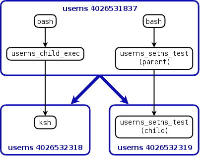

# この文書について

この文書は [lwn.net](https://lwn.net/) において 2013 年に公開された Namespaces in Operation シリーズのパート 5  ([http://lwn.net/Articles/532593/](http://lwn.net/Articles/532593/))を翻訳したものです。

この文書のライセンスは原文と同じく、[Creative Commons CC BY-SA 4.0](https://creativecommons.org/licenses/by-sa/4.0/) のもとに提供されています。

# Namespaces in operation, part 6: more on user namespaces

この記事では，ユーザ名前空間の[先の議論](https://lwn.net/Articles/532593/)を続ける。特に、ユーザ名前空間の相互作用とケーパビリティ、他の名前空間とユーザ名前空間を一緒に使う場合についてもう少し詳細に見ていく。当面は少なくとも、この記事は名前空間に関するこのシリーズのまとめとなるだろう。

## ユーザ名前空間とケーパビリティ

それぞれのプロセスは特定のユーザ名前空間と結びついている。`fork()` もしくは `CLONE_NEWUSER` フラグのない `clone()` の呼び出しによって生成したプロセスは、親プロセスと同じユーザ名前空間内に存在する。もし、変更先の名前空間で `CAP_SYS_ADMIN` を持っている場合は、プロセスは `setns()` を使って存在するユーザ名前空間を変更することができる。この場合、プロセスはターゲットとなる名前空間上でフルセットのケーパビリティを得る。

一方で `clone(CLONE_NEWUSER)` の呼び出しは新しいユーザ名前空間を作成し、子プロセスをその名前空間に置く。この呼び出しは二つの名前空間の間に親子関係も確立する。つまり、ユーザ名前空間は (初期の名前空間以外は) (`clone(CLONE_NEWUSER)` を使って名前空間を作成したプロセスのユーザ名前空間である) 親を持つ。ユーザ名前空間の間の親子関係は、プロセスが `unshare(CLONE_NEWUSER)` を呼び出したときも確立される。`clone` と `unshare` の違いは、`unshare()` は呼び出し元を新しいユーザ名前空間に配置し、その名前空間の親は呼び出し元が元に属していた名前空間となることである。以下を見るとすぐわかるように、ユーザ名前空間の間の親子関係は、プロセスが子供の名前空間で持つであろうケーパビリティを定義するという意味で重要である。

それぞれのプロセスは 3 つの関連するケーパビリティセットも持つ: Permitted, Inheritable, Effective である。[capabilities(7)](http://man7.org/linux/man-pages/man7/capabilities.7.html)に、これらの 3 つについて少し詳細に説明がある。この記事では、我々の興味の対象である effective ケーパビリティについて主に述べる。このセットはプロセスが特権オペレーションを実行する時の能力を決める。

ユーザ名前空間は (effective) ケーパビリティが解釈される方法を変える。最初に、特定のユーザ名前空間内でケーパビリティを持っていることは、プロセスがその名前空間が管理しているリソース上の操作を実行するときのみ有効となる。後ほど、ユーザ名前空間と他の名前空間の相互作用について話す時に、もう少しこの点について話をする。さらに、プロセスが特定のユーザ名前空間内でケーパビリティを持っているか否かは、その名前空間のメンバーであることと、ユーザ名前空間間の親子関係によって決まる。このルールはいかのようなものである。

1. プロセスがその名前空間のメンバーであり、とあるケーパビリティが effective ケーパビリティセットに存在してる場合、プロセスはユーザ名前空間内でそのケーパビリティを持つ。プロセスはいくつかの方法で effective セット内にケーパビリティを得る可能性がある。その最も一般的な理由は、ケーパビリティを与えられたプログラム (set-user-ID プログラムやファイルケーパビリティを与えられたプログラムなど) を実行することか、自動的にフルセットのケーパビリティを得る `clone(CLONE_NEWUSER)` で呼ばれた子プロセスであることである。
1. プロセスがユーザ名前空間内でケーパビリティを持つ場合、そのプロセスは全ての子供 (と更に削除された子孫) の名前空間内でもそのケーパビリティを持つ。言い換えれば、新しいユーザ名前空間を作成することは、親の名前空間内の特権プロセスの効果から、その(新しく作成した)名前空間のメンバーを隔離することはない。
1. ユーザ名前空間が作成されたとき、カーネルは作成しているプロセスの実効ユーザ ID をその名前空間の「オーナー」として記録する。前のルールの効果により、これらのケーパビリティは全ての子孫の名前空間に同様に伝播する。これは、新しいユーザ名前空間の作成後、親の名前空間内の同じユーザが所有する他のプロセスは、その新しい名前空間内で全てのケーパビリティを持つということである。

3 つ目のルールを小さなプログラム [userns_setns_test.c](http://lwn.net/Articles/541230/) の助けを借りてデモすることができる。このプログラムはコマンドライン引数: `/proc/PID/ns/user` のパス名を 1 つ取る。このプログラムは新しいユーザ名前空間内に子プロセスを作成し、親 (親はプログラムを起動したシェルと同じ名前空間に留まっている) と子は `setns()` を使ってコマンドライン上で指定された名前空間に入ろうとする。先に注意したとおり、`setns()` は呼び出し元が `CAP_SYS_ADMIN` ケーパビリティをターゲットとなる名前空間で持っている必要がある。

デモのために、このシリーズの先の記事で作成した [userns_child_exec.c](http://lwn.net/Articles/539940/) と共にこのプログラムを使う。まず、このプログラムを使って新しいユーザ名前空間で実行されるシェルを起動する (ここではプロセスの名前を区別して作成するために `ksh` を使う)。

```
$ id -u
1000
$ readlink /proc/$$/ns/user       # Obtain ID for initial namespace
user:[4026531837]
$ ./userns_child_exec -U -M '0 1000 1' -G '0 1000 1' ksh
ksh$ echo $$                      # Obtain PID of shell
528
ksh$ readlink /proc/$$/ns/user    # This shell is in a new namespace
user:[4026532318]
```

ここで、最初の名前空間で実行しているシェルに移動するために別のターミナルウィンドウに移動して、テストプログラムを実行する。

```
$ readlink /proc/$$/ns/user       # Verify that we are in parent namespace
user:[4026531837]
$ ./userns_setns_test /proc/528/ns/user
parent: readlink("/proc/self/ns/user") ==> user:[4026531837]
parent: setns() succeeded

child:  readlink("/proc/self/ns/user") ==> user:[4026532319]
child:  setns() failed: Operation not permitted
```

後のプログラムは、以下のように作られた色々なプロセスと名前空間の間の親子関係を示している (黒の矢印)



それぞれのシェルセッションの最初の `readlink` コマンドの出力を見ると、`userns_setns_test` が実行された時作られた親プロセスは初期のユーザ名前空間 (4026531837) にいることがわかる ([このシリーズの先の記事](http://lwn.net/Articles/531381/#proc_pid_ns)で注意したように、これらの番号は `/proc/PID/ns` ディレクトリ内のシンボリックリンクに対する inode 番号である)。先のルール 3 によって、親プロセスは新しいユーザ名前空間 (4026532318) を作ったプロセスと同じ実効ユーザ ID (1000) を持っているので、その名前空間内で  `CAP_SYS_ADMIN` を含む全てのケーパビリティを持っている。なので親の中での `setns()` 呼び出しは成功する。

一方で、`userns_setns_test` が作った子プロセスは異なる名前空間 (4026532319) にいる。実際は ksh プロセスが実行されている名前空間の兄弟名前空間にいる。このように、先に説明したルールの 2 番目は適用されない。なぜならその名前空間は 4026532318 の祖先ではないからである。なので、子プロセスは `CAP_SYS_ADMIN` ケーパビリティをその名前空間内では持たないため、`setns()` の呼び出しは失敗する。

## ユーザ名前空間と他の名前空間の同時使用

ユーザ名前空間以外の名前空間を作成するには `CAP_SYS_ADMIN` ケーパビリティが必要である。一方で、ユーザ名前空間を作成するには (Linux 3.8 以降は) ケーパビリティは不要である。名前空間の最初のプロセスは (その新しいユーザ名前空間内では) フルセットのケーパビリティを得る。これは、プロセスは 2 度目の `clone()` の呼び出しでどんなタイプの名前空間も作ることが可能であるということを意味する。

しかし、この 2 ステップのプロセスは必要ではない。新しいユーザ名前空間を作るための `CLONE_NEWUSER` を指定する同じ `clone()` (or `unshare()`) に追加の `CLONE_NEW*` を含める事も可能である。この場合、カーネルは `CLONE_NEWUSER` フラグを先に実行し、新しいユーザ名前空間を作成して、その中に作られる子供が全てのケーパビリティを持つことを保証する。それから、カーネルは残りの `CLONE_NEW*` を実行し、指定の新しい名前空間を作成し、その全ての名前空間のメンバーである子プロセスを作成する。

それゆえ、例えば、非特権プロセスが以下のような形の呼び出しで、新しいユーザ名前空間と新しい UTS 名前空間の両方のメンバーである子プロセスを作成することが可能である。

```
clone(child_func, stackp, CLONE_NEWUSER | CLONE_NEWUTS, arg);
```

`userns_child_exec` プログラムを使うと、上記と同等の `clone()` 呼び出しを実行し、子プロセス内でシェルを実行することが可能である。以下のコマンドは新しい UTS 名前空間 (`-u`) と新しいユーザ名前空間 (`-U`) の作成を指定している。このユーザ名前空間内では、ユーザ ID とグループ ID の両方ともの 1000 が 0 にマッピングされる。

```
$ uname -n           # Display hostname for later reference
antero
$ ./userns_child_exec -u -U -M '0 1000 1' -G '0 1000 1' bash
```

予想通り、シェルプロセスはフルセットの permitted と effective ケーパビリティを持っている。

```
$ id -u              # Show effective user and group ID of shell
0
$ id -g
0
$ cat /proc/$$/status | egrep 'Cap(Inh|Prm|Eff)'
CapInh: 0000000000000000
CapPrm: 0000001fffffffff
CapEff: 0000001fffffffff
```

上記の出力で、Hex 値 1fffffffff は、現時点での Linux の全ての 37 のケーパビリティセットが有効であることを表している。

ここで、UTS 名前空間で隔離されているグローバルリソースの一つであるホスト名を `hostname` コマンドを使って変更することができる。この操作には `CAP_SYS_ADMIN` が必要である。最初に、ホスト名を新しい値に変更する。それから `uname` コマンドでその辺りを表示する。

```
$ hostname bizarro     # Update hostname in this UTS namespace
$ uname -n             # Verify the change
bizarro
```

初期の UTS 名前空間内で実行されている、他のターミナルウィンドウに移動し、その UTS 名前空間でホスト名をチェックする。

```
$ uname -n             # Hostname in original UTS namespace is unchanged
antero
```

以上の出力から、親の UTS 名前空間では見えない子供の UTS 名前空間内でホスト名を変更することをみることができた。

## ケーパビリティふたたび

カーネルはユーザ名前空間内の初期プロセスに全てのケーパビリティを与えるが、これは、その後でプロセスがシステムワイドでスーパーユーザの特権を持つことは意味しない。(しかし、従来は root だけがアクセスできたカーネルコード内の弱点にアクセスできるようになったことは意味するかもしれない。[このメール](http://lwn.net/Articles/540083/)にある tmpfs のマウントの問題に存在した脆弱性のような。)新しい IPC、マウント、ネットワーク、PID、UTS 名前空間が `clone()` か `unshare()` で作られた際、カーネルは新しい名前空間に対して作成するプロセスのユーザ名前空間を記録する。プロセスが名前空間が管理しているグローバルリソースの操作をしようとするときはいつでも、カーネルがその名前空間に関連付けたユーザ名前空間内のプロセスのケーパビリティによってパーミッションチェックが実行される。

例えば、`clone(NEW_USER)` を使ってユーザ名前空間を作成すると仮定しよう。生成される子プロセスは新しいユーザ名前空間内ではフルセットのケーパビリティを持つ。これは、例えば、他のタイプの名前空間を作成することが可能になることと、自身のユーザ、グループ ID と名前空間内でマッピングされる他の ID を変えることが可能になることを意味する。(このシリーズの前の記事にあるように、我々は親の名前空間内の特権プロセスのみが、名前空間を作成するプロセスの実効ユーザ、グループ ID 以外の ID へのマッピングを作成することができることを見ているので、ここにはセキュリティ的な抜け道は存在しない。)

一方で、子プロセスはファイルシステムをマウントできない。子プロセスはまだ初期のマウント名前空間に留まっており、その名前空間内でファイルシステムをマウントするためには、マウント名前空間と関連付いたユーザ名前空間内でケーパビリティを持つ必要がある (すなわち、初期のユーザ名前空間内でのケーパビリティが必要ということである)。このケーパビリティは子プロセスは持っていない。同様のことが IPC, ネットワーク、PID、UTS 名前空間で隔離されたグローバルリソースに対しても言える。

その上、子プロセスは名前空間が (現時点では) 持っていないケーパビリティが必要な特権操作を行うことはできない。それゆえ、例えば、子プロセスは自身のリソースのハードリミットを上げたり、システム時間を設定したり、プロセスの優先度を設定したり、カーネルモジュールをロードしたり、<del>システムをリブートしたり</del>といったようなことを行うことはできない。これらの操作は全て、ユーザ名前空間の階層構造の外部に存在するケーパビリティが必要であり、事実上、これらの操作は呼び出し元が初期のユーザ名前空間内でケーパビリティを持っていることが必要となる。

名前空間に対するケーパビリティの効果を隔離することによって、ユーザ名前空間は以上のように、特権のないユーザが、従来は root に限定されていた機能へのアクセスを、安全性を保証しながら実行することを可能にした。これにより、新しい種類のユーザ空間アプリケーションに対する面白そうな可能性が創りだされた。例えば、今後は非特権ユーザが root 特権なしで Linux コンテナを実行できるようになったり、[Chromeスタイルのサンドボックス](http://dev.chromium.org/developers/design-documents/sandbox)を `setuid` 使用の助けを借りずに構築可能になったり、[fakeroot](http://fakeroot.alioth.debian.org/)タイプのアプリケーションをダイナミックリンクのトリックを使わずに実装出来るようになったり、プロセスの隔離のための[chroot()ベースのアプリケーション](http://lwn.net/Articles/252794/)を実装できるようになったりした。カーネルのバグがなければ、特権が必要なカーネルの機能にアクセスするためにユーザ名前空間を採用したアプリケーションは、`setuid` ベースの伝統的なアプリケーションに比べてよりセキュアになった。ユーザ名前空間ベースのアプローチで、アプリケーションがセキュリティ侵害を受けたとしても、システム全体にダメージを与えるのに使えるような特権は持っていない。

*著者は、このシリーズを書く過程の名前空間に関する実験で生じた多数の質問への回答に対して、Eric Biederman に感謝を述べたい。*
